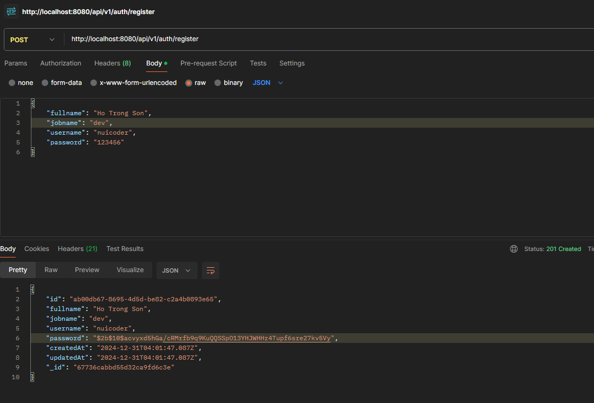
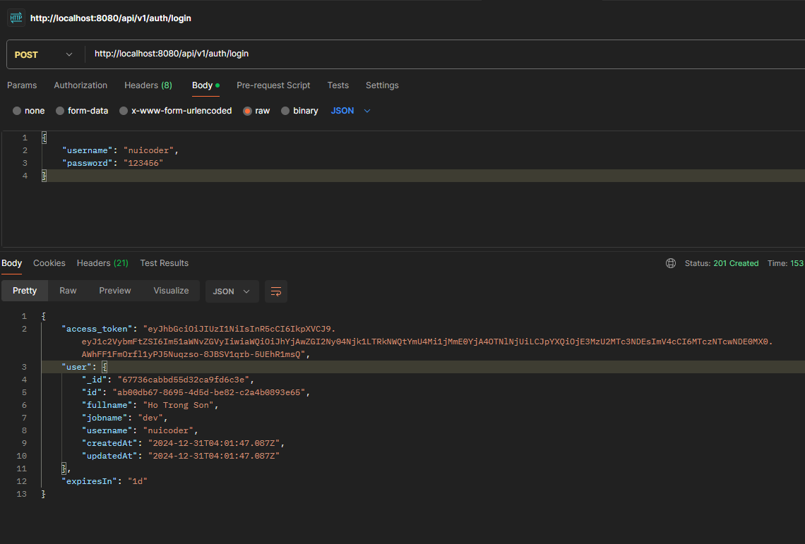
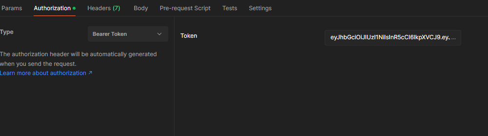
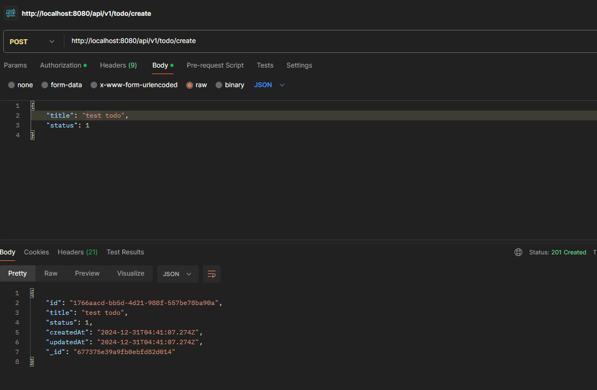
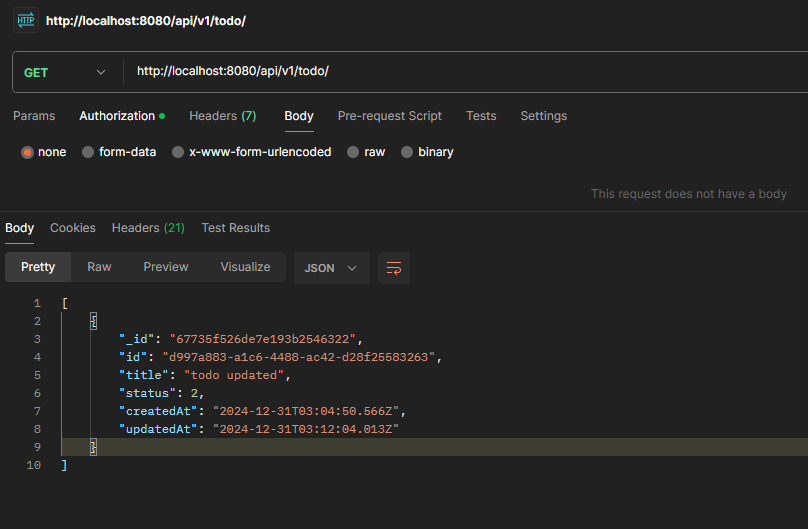
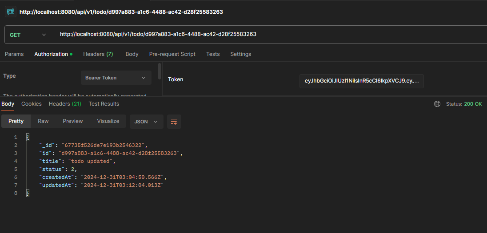
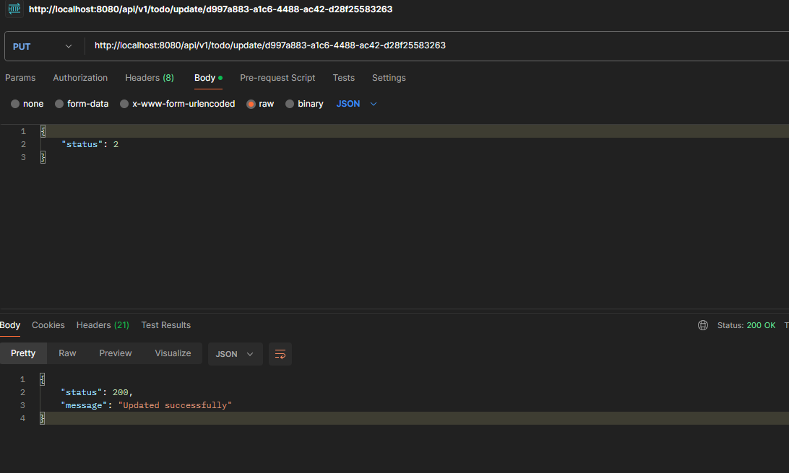
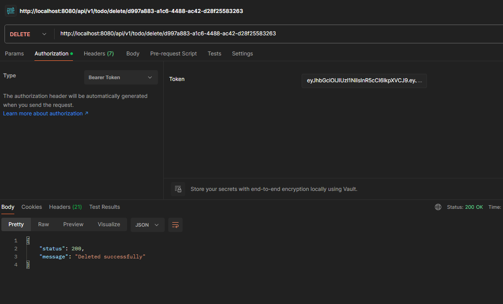

# Public api Auth - CRUD for Todo app basic

<p style="font-size: 15px">
This just a simple TODO API with AUTH, GET, POST, PUT and DELETE endpoints for user and todo. I made this with Mongoose.
You can access this API for free, just in case you need a CRUD API when you currently learning a Front-End
</p>

<span style="font-weight: bold">
👉 You'all can access the API URL on:
</span>
<p style="font-size: 15px; font-weight: bold">
End point api test in postman:
</p>

```shell
https://public-api-auth-crud-todo-app-production.up.railway.app/api/v1/auth/register
```

## Description

[Nest](https://github.com/nestjs/nest) framework TypeScript starter repository.
[MongoDB](https://www.mongodb.com/) DB manager

### This an example how you accessing the API and the responses you will got

**#REGISTER**


**#LOGIN**


⚠️ After login, you must add token to authentication for all api (example bottom):


**#CREATE-TODO**


**#GET-LIST-TODO**


**#GET-TODO-BY-ID**


**#UPDATE-TODO-BY-ID**


**#DELETE-TODO-BY-ID**


⛔️ For example api of USER is same api TODO above.

## Support

Nest is an MIT-licensed open source project. It can grow thanks to the sponsors and support by the amazing backers. If you'd like to join them, please [read more here](https://docs.nestjs.com/support).

## Stay in touch

- Author - [NuiCoder](https://jazzy-quokka-17d1ac.netlify.app/) - [Facebook](https://www.facebook.com/trong.son.950202)
- Website - [https://nestjs.com](https://nestjs.com/)
